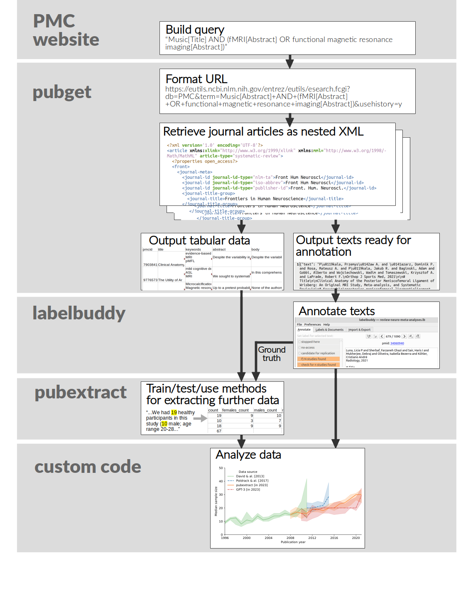

Background: We know that methods influence results in neuroimaging, and that some methods influence results in a non-random manner. For example, it's easier to get false-positive results in certain brain areas when using cluster-wise inference. But we don't know whether this could bias results meta-analytic level; could we see meta-analytic results that are due to many studies using a certain method (i.e., analytic bias)? To investigate this, we will test the hypothesis that methodological trends effect meta-analytic results in a non-random spatial distribution.

Methods: We will use one or more open fMRI datasets, including several tasks. We will model the data with fake tasks to generate null results, that is, to control for the effect of the actual task on the results. We will preprocess and analyze the data following different pipelines, systematically altering parameters related to a method of interest. For example, we could analyze the data with many pipelines, once including cluster-wise inference, and once excluding it. Then we will meta-analyze the results within each group. We will test the difference between these meta-analytic maps against a uniform spatial distribution.

